<script src="https://cdn.jsdelivr.net/npm/mermaid@10.6.1/dist/mermaid.min.js"></script>
<script>
mermaid.initialize({
  startOnLoad: true,
  theme: 'default',
  themeVariables: {
    primaryColor: '#667eea',
    primaryTextColor: '#fff',
    primaryBorderColor: '#764ba2',
    lineColor: '#667eea',
    secondaryColor: '#f8f9fa',
    tertiaryColor: '#e9ecef'
  }
});
</script>

# 商業高等学校教員向け 生成AI利活用セミナー
## 詳細講義資料

---

## 📚 配布資料ダウンロード

### プロンプト基本テンプレート集
- [5W1H確認シート](./templates/5W1H_confirmation_sheet.md) - プロンプト作成前のチェックリスト
- [4要素構造テンプレート](./templates/4_elements_structure_template.md) - 効果的なプロンプト設計の基本構造
- [科目別基本プロンプト](./templates/subject_basic_prompts.md) - 商業教育各分野の基本テンプレート

### 商業教育分野別プロンプト事例集
- [簿記・会計分野（15例）](./examples/bookkeeping_prompt_examples.md) - 学習指導案から検定対策まで
- [マーケティング分野（10例）](./examples/marketing_prompt_examples.md) - 事例研究からプロジェクト学習まで
- [情報処理分野（8例）](./examples/it_prompt_examples.md) - 実習指導からプログラミング学習まで
- [ビジネス基礎分野（7例）](./examples/business_basics_prompt_examples.md) - 職業理解からコミュニケーション指導まで

### プロンプト評価チェックリスト
- [明確性・構造化・教育的配慮チェック項目](./tools/prompt_evaluation_checklist.md) - 質の高いプロンプト作成のための確認項目

### 継続学習ガイド
- [実践記録シート](./tools/practice_record_sheet.md) - プロンプト活用の継続的改善のための記録
- [改善アクションプラン](./tools/improvement_action_plan.md) - スキル向上のための体系的計画

---

## セミナー概要

### セミナーの目的
本セミナーは、商業高等学校で教鞭を執る先生方が、生成AI技術を教育現場で効果的に活用できるようになることを目的としています。特に「プロンプトエンジニアリング」と呼ばれる、AIへの適切な指示方法を習得することで、日々の教育活動を大幅に効率化し、教育の質を向上させることができます。

### 対象者
- 商業高等学校の教員（生成AI初心者の方大歓迎）
- 簿記、会計、マーケティング、情報処理、ビジネス基礎等を担当されている先生方
- ICTを活用した教育改善に興味をお持ちの先生方

### セミナー構成
- **総時間**: 90分
- **形式**: 講義＋体験＋演習（実習中心）
- **持ち物**: ノートPC またはタブレット（インターネット接続必須）

**セミナータイムライン（90分）**

| 時間 | セクション | 内容 | 
|------|-----------|------|
| 0-15分 | 第1部：基礎理解 | 生成AI概要・プロンプト基本概念 | 
| 15-40分 | 第2部：基本原則 | 明確性・構造化・文脈提供の原則 |
| 40-75分 | 第3部：実践活用 | 授業設計・教材作成・学生サポート・業務効率化 | 
| 75-85分 | 第4部：高度技術 | 高度プロンプト技術 |
| 85-90分 | 第5部：まとめ | 実践・まとめ |

---

## 第1部：生成AIとプロンプトの基礎理解（15分）

### 1.1 生成AIとは何か？（5分）

#### 生成AIの定義
生成AI（Generative AI）とは、テキスト、画像、音声などの新しいコンテンツを人工的に生成する技術です。

**生成AIの種類と機能**

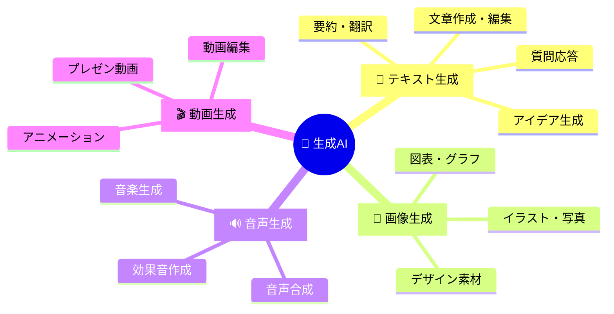

**教育現場での活用例**

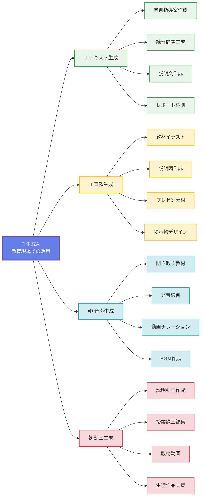

**主要な生成AIサービス**：
- **Microsoft Copilot** (Microsoft)
- **ChatGPT**（OpenAI社）
- **Claude**（Anthropic社）
- **Gemini**（Google社）

#### 教育現場での活用可能性

**生成AI活用の4つの柱**

### 🎯 授業準備効率化
- 学習指導案下書き
- 練習問題自動生成
- 教材説明文作成
- 評価基準設定

### 👨‍🎓 個別指導充実
- レベル別課題作成
- 個別フィードバック
- 進路指導資料
- 学習計画立案

### ⚡ 業務効率化
- 会議資料作成
- 保護者向け文書
- 報告書構成支援
- メール文面作成

### 📈 教育の質向上
- 最新事例収集
- 多角的視点提供
- 創造的活動支援
- 批判的思考促進

1. **授業準備の効率化**
   - 学習指導案の下書き作成
   - 練習問題・課題の自動生成
   - 教材説明文の作成

2. **個別指導の充実**
   - 生徒の学習レベルに応じた課題作成
   - 個別フィードバックの生成
   - 進路指導資料の作成

3. **業務効率化**
   - 会議資料の下書き作成
   - 保護者向け文書の作成
   - 報告書の構成支援

#### 商業教育との親和性
商業教育は実社会との関連が深く、以下の特徴があります。
- **実践性重視**: 生成AIで実際のビジネス事例を簡単に作成
- **資格取得支援**: 検定試験の練習問題を大量生成
- **キャリア教育**: 業界情報や職業情報を最新データで取得

**重要なポイント**：生成AIは「教師の代替」ではなく「教師の能力を拡張するツール」です。

### 1.2 プロンプトの基本概念（10分）

#### プロンプトとは？
プロンプト（Prompt）とは、生成AIに対する指示や質問のことです。「AIへの指示書」と考えてください。

**例：悪いプロンプト**
```
簿記について教えて
```

**例：良いプロンプト**
```
あなたは商業高校の簿記担当教師です。
高校1年生（簿記初心者）に向けて、
「資産・負債・純資産」の概念を、
身近な例を使って分かりやすく5分で説明できる内容を、
話し言葉で300文字程度で作成してください。
```

**例: 生成AIが正しく理解し、よりよい回答ができるように構造化されたプロンプト**
```
### あなたの役割
- 商業高校の簿記担当教師
### 目的
- 高校１年生（簿記初心者）に「資産・負債・純資産」の基本概念を理解させる
### 対象
- 高校１年生
- 簿記未習・初心者
### タスク
- 身近な具体例を用いて
- 話し言葉で
- ５分で説明できる内容を
- 約300文字にまとめる
### 制約条件
1. 専門用語はできるだけ平易に言い換える
2. 資産・負債・純資産の３用語を必ず登場させる
3. 例え話は日常生活（例：スマホ代、貯金、アルバイト代など）から選ぶ
4. 生徒が質問しやすいよう、最後に一言問いかけを入れる
### 出力形式
- 日本語
- 口語調（です／ます調）
- 段落や箇条書きは使わず、一続きの文章
```

#### プロンプトの品質が結果を決める
同じ生成AIでも、プロンプトの書き方によって出力の質が大きく変わります。

**プロンプトの品質による結果の違い**

| プロンプトの種類 | 入力例 | 出力の特徴 | 実用性 |
|-----------------|--------|------------|--------|
| ❌ **曖昧なプロンプト** | 簿記について教えて | 基本的な説明のみ<br/>すぐには使えない | **低** |
| ✅ **具体的なプロンプト** | 高校1年生向け<br/>5分で説明可能<br/>身近な例を使用<br/>300文字程度 | 授業ですぐ使える<br/>具体的な内容<br/>適切な分量 | **高** |

**実例比較**：
- 曖昧な指示 → 一般的で使えない回答
- 具体的な指示 → 即座に授業で使える回答

#### 【体験コーナー】簡単なプロンプトを試してみましょう
参加者の皆様、お手元のデバイスで Copilot Edge にアクセスしてください。

#### 【演習1】
 以下のプロンプトを入力してみてください。
```
商業高校のマーケティング授業で使える、身近な企業の成功事例を1つ教えてください。
```

#### 【演習2】 
より詳細なプロンプトを試してみてください。
```
あなたは商業高校のマーケティング教師です。
高校2年生に「ターゲティング戦略」を教える際に使用する、
日本の身近な企業（コンビニ、ファーストフード等）の具体的成功事例を、
以下の構成で800文字程度で作成してください：
1. 企業名と概要
2. ターゲティング戦略の内容
3. 成功要因の分析
4. 生徒への質問（考察ポイント）
```

#### 【課題】 

2つの回答の違いを確認し、どちらがより教育現場で使いやすいか話し合ってみましょう。

> **注釈**: 最近の生成AIは推論機能が大幅に発達しており、従来よりも言葉足らずなプロンプトでも良い応答をするようになりました。ただし、教育現場での実用性を考えると、より具体的で構造化されたプロンプトの方が一貫して質の高い結果を得られるため、基本的なプロンプト設計技術の習得は依然として重要です。

---

## 第2部：プロンプト設計の基本原則（25分）

### 2.1 明確性の原則（10分）

#### Role+5W1H を意識した指示
良いプロンプトには必ず以下の要素が含まれています。

| 要素 | 内容 | 具体例 |
|------|------|--------|
| **Role**（役割） | AIに求める専門性・立場 | 簿記教師、キャリアカウンセラー、企業経営者 |
| **Who**（誰が） | 対象者・読み手 | 高校1年生、保護者、同僚教師 |
| **What**（何を） | 作成する内容 | 学習指導案、練習問題、説明資料 |
| **When**（いつ） | 時期・タイミング | 新学期、中間試験前、進路指導時期 |
| **Where**（どこで） | 使用場面・環境 | 教室、実習室、保護者会 |
| **Why**（なぜ） | 目的・理由 | 理解促進、動機付け、技能習得 |
| **How**（どのように） | 方法・形式 | 講義形式、グループワーク、個別指導 |

#### 具体的な表現の重要性

**❌ 曖昧な表現の例**
- 「分かりやすく」→ 具体的にどのレベルで？
- 「詳しく」→ どの程度の詳しさ？
- 「いい感じに」→ 何をもって「いい感じ」？

**✅ 具体的な表現の例**
- 「高校1年生が理解できるレベルで」
- 「専門用語には必ず注釈を付けて」
- 「A4用紙1枚に収まる分量で」

#### 【演習3】曖昧な指示を明確にする練習（5分）

以下の曖昧なプロンプトを、Role + 5W1Hを使って具体的に改善してください。
次の曖昧なプロンプトを改善してください。
```
原価計算について説明してください。
```

**改善のポイント**：
- Role: AIにどの専門家の立場で回答してもらうか？
- Who: 対象者は？（学年、既習レベル）
- What: 原価計算のどの部分？（全体概要？特定の計算方法？）
- Why: なぜ学ぶのか？（目的の明確化）
- How: どのような形式で？（講義？演習？）

**Role+5W1H での整理例**：

| 要素 | 内容 |
|------|------|
| **Role（役割）** | 商業高校の原価計算担当教師 |
| **Who（誰に）** | 高校3年生〈簿記2級を学習済み〉 |
| **What（何を）** | 製造業の具体例を使って「個別原価計算」の基本的な流れを解説する原稿 |
| **When（いつ）** | 10分で話し終えられる長さ |
| **Where（どこで）** | 商業高校の授業（対面講義想定） |
| **Why（なぜ）** | 生徒が個別原価計算の手順と目的を実務イメージと結び付けて理解できるようにするため |
| **How（どのように）** | - 話し言葉で約600文字にまとめる<br/>- 製造工程（例：オーダーメイド家具製造）を用いて順を追って説明<br/>- 専門用語には簡潔な言い換えor補足を付ける<br/>- 最後に理解確認の問いかけを1つ加える |

**改善例**：
```
あなたは商業高校の原価計算担当教師です。

高校 3 年生〈簿記 2 級を学習済み〉に向けて、オーダーメイド家具製造を例に「個別原価計算」の基本的な流れを 10 分で説明できる原稿を作成してください。

- 話し言葉で約 600 文字
- 工程ごとの原価集計 → 仕掛品勘定への振替 → 製品完成までを順序立てて解説
- 専門用語は平易に補足
- 終わりに「ここまでで疑問はある？」など理解確認の問いかけを 1 行入れる
```

#### 【演習4】 
以下の構造を意識して、構造化されたプロンプトを作成してください。


```
### あなたの役割

### 目的

### 対象

### タスク

### 制約条件

### 出力形式
```

**改善例**:

```
## 役割・ペルソナ
- あなたは商業高校の原価計算担当教師です
- 簿記教育に精通し、生徒に分かりやすく教えることを重視します

## 対象・前提条件
- **対象者**: 高校3年生
- **既習内容**: 簿記2級を学習済み
- **授業時間**: 10分間の説明

## 目的・学習目標
- 個別原価計算の基本的な流れを理解させる
- オーダーメイド家具製造を具体例として使用
- 理論と実務を結びつけて理解を促進

## 内容構成・順序
以下の流れで順序立てて解説してください：

1. **導入**: 個別原価計算とは何か（オーダーメイド家具製造の特徴）
2. **工程ごとの原価集計**
   - 材料費の集計方法
   - 労務費の集計方法  
   - 経費の集計方法
3. **仕掛品勘定への振替**
   - 各原価要素の仕掛品勘定への計上
   - 仕掛品勘定の役割と意味
4. **製品完成まで**
   - 完成品への振替プロセス
   - 製品勘定への計上

## 文体・表現要件
- **文字数**: 約600文字
- **文体**: 話し言葉（授業での口調）
- **専門用語**: 平易な言葉で補足説明を必ず付ける
- **具体例**: オーダーメイド家具製造の場面を想像しやすく描写

## 構成要素
- **理解確認**: 最後に「ここまでで疑問はある？」など、生徒の理解を確認する問いかけを1行入れる

## 期待する成果物
- 10分で説明できる、構造化された授業原稿
- 生徒が個別原価計算の全体像を把握できる内容
- 次の学習ステップにつながる基礎理解の確立
```


### 2.2 構造化の原則（10分）

#### プロンプトの基本構造
効果的なプロンプトは以下の4つの要素で構成されます。

**効果的なプロンプトの4つの構造要素**

### 🎯 **1. 役割設定**
- あなたは○○の専門家です
- 専門的視点の付与
- 適切な回答レベル設定

### 📋 **2. タスク指示**
- ××について△△してください
- 具体的な動作指示
- 明確な成果物の指定

### ⚙️ **3. 条件・制約**
- 対象者・レベル
- 時間・分量制約
- 使用場面・目的

### 📄 **4. 出力形式**
- 文字数・構成
- 出力フォーマット
- 必要項目の指定

**構造テンプレート**：
```
1. 【役割設定】
   あなたは○○の専門家です。

2. 【タスク指示】  
   ××について△△してください。

3. 【条件・制約】
   以下の条件で実施してください：
   - 条件1
   - 条件2
   - 条件3

4. 【出力形式】
   以下の形式で出力してください：
   - 形式の指定
   - 文字数・分量
   - 構成・項目
```

#### 各要素の詳細説明

**1. 役割設定の重要性**
AIに専門家の視点を与えることで、より専門的で適切な回答を引き出せます。

商業教育での役割設定例：
- 「商業高校の簿記教師」
- 「キャリアカウンセラー」
- 「中小企業診断士」
- 「マーケティング専門家」

**2. タスク指示の具体化**
「作成してください」「説明してください」だけでなく、より具体的な動詞を使用：
- 「分析してください」
- 「比較検討してください」
- 「提案してください」
- 「評価してください」

**3. 条件・制約の設定**
制約を設けることで、より実用的な回答が得られます。
- 時間制約：「50分授業用」「3分スピーチ用」
- 対象制約：「初心者向け」「検定試験対策用」
- 形式制約：「箇条書きで」「表形式で」

**4. 出力形式の指定**
明確な形式指定により、そのまま使える成果物が得られます。
- 文字数：「300文字程度」「A4用紙1枚分」
- 構成：「導入・展開・まとめの3部構成で」
- レイアウト：「見出しを付けて」「番号付きリストで」

#### 【演習5】構造化されたプロンプトの作成（5分）

「マーケティングミックス（4P）」について、構造化されたプロンプトを作成してください。

**作成手順**：
1. 役割設定を決める
2. 具体的なタスクを設定
3. 必要な条件・制約を列挙
4. 出力形式を明確に指定

**作成例**：
```
【役割設定】
あなたは商業高校のマーケティング担当教師です。

【タスク指示】
「マーケティングミックス（4P）」について、実際の企業事例を使った授業用資料を作成してください。

【条件・制約】
- 対象：高校2年生（マーケティング初学者）
- 時間：50分授業用
- 事例企業：身近な日本企業を1社選択
- 各Pごとに具体的な施策を説明
- 生徒が考察できる問いを含める

【出力形式】
以下の構成で1200文字程度：
1. マーケティングミックスとは（概要説明）
2. 選択企業の紹介
3. 4Pの具体的分析
4. 生徒への考察問題（3問）
```

### 2.3 文脈提供の重要性（5分）

#### 背景情報の提供方法
AIに十分な文脈を提供することで、より適切な回答を得られます。

**提供すべき文脈情報**：
1. **教育環境**：学校の特徴、生徒の特性、地域性
2. **学習状況**：既習内容、習熟度、学習目標
3. **制約条件**：時間、設備、予算等の現実的制約
4. **期待する成果**：最終的に達成したい目標

**文脈提供の具体例**：
```
【背景情報】
本校は地方の商業高校で、卒業生の約70%が地元企業に就職します。
生徒は実践的な学習を好み、将来の職業との関連を重視する傾向があります。
現在、簿記2級取得を目指すクラスで、工業簿記の学習に入ったところです。
```

#### 対象者の明確化
生成AIは対象者のレベルや特性を理解して回答を調整します。

**対象者情報の例**：
- **学習レベル**：「簿記初心者」「3級取得済み」「2級学習中」
- **学習特性**：「理論より実践を好む」「計算は得意だが理論が苦手」
- **将来目標**：「就職希望」「進学希望」「公認会計士志望」

#### 目的の共有
なぜその教材や指導案が必要なのか、目的を明確にすることで、より実用的な成果物が得られます。

**目的の例**：
- 「基礎概念の理解促進」
- 「実践的技能の習得」
- 「検定試験対策」
- 「職業理解の深化」

---

## 第3部：商業教育での実践的活用（35分）

**商業教育でのAI活用 - 4つの実践領域**

## 🎓 **授業設計支援**
- 学習指導案作成
- 評価基準設定
- 教材開発アイデア

## 📚 **教材作成支援**
- 練習問題生成
- 事例研究作成
- 説明文作成

## 👨‍🎓 **学生サポート**
- 個別フィードバック
- 進路指導資料
- 保護者向け資料

## ⚡ **業務効率化**
- 会議資料作成
- 報告書下書き
- メール文面作成

### 3.1 授業設計支援（10分）

#### 学習指導案の作成補助
生成AIを使って学習指導案の下書きを作成し、教師の創意工夫に時間を集中できます。

**学習指導案作成プロセス**

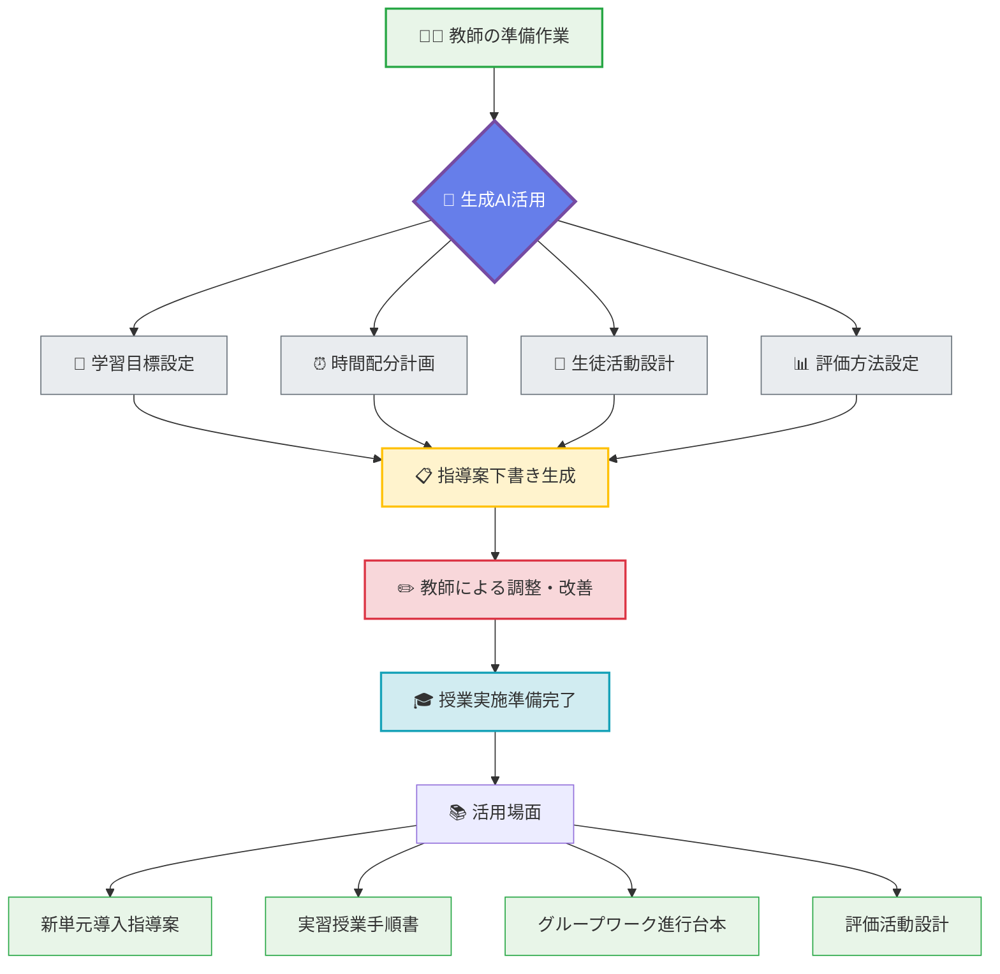

**効果的なプロンプトの要素**：
1. **学習目標の明確化**：知識・技能・思考力等の観点別目標
2. **時間配分の指定**：導入・展開・まとめの時間設定
3. **生徒活動の重視**：アクティブラーニング要素の組み込み
4. **評価方法の明記**：形成的評価・総括的評価の設定

#### 教材開発のアイデア出し
従来は時間がかかっていた教材作成のアイデア出しが短時間で可能になります。

**教材開発アイデア創出プロセス**

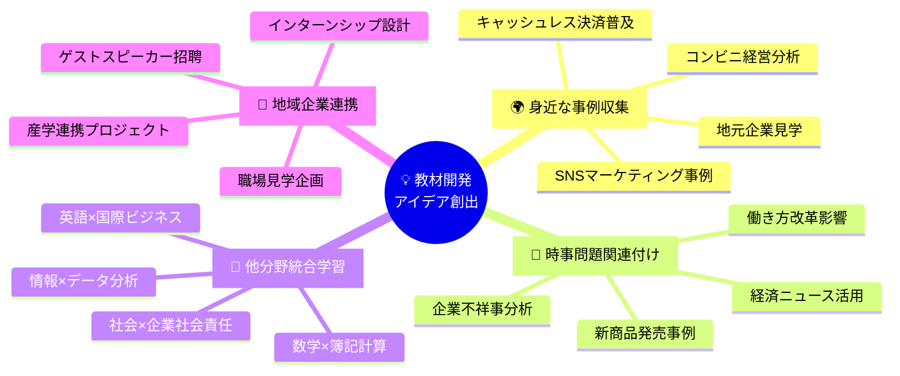

**生成AIによる効率化効果**

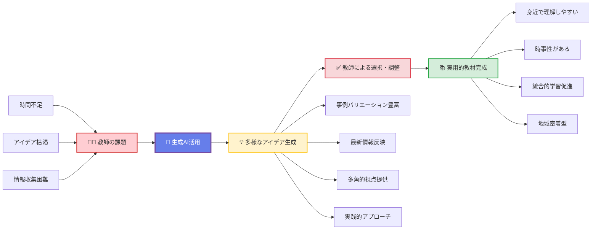

**活用例の詳細説明**：

**🌍 身近な事例の収集**
生成AIを活用することで、教師が思いつかないような身近で具体的な事例を短時間で大量に収集できます。例えば、「コンビニの売上向上策」について質問すると、立地戦略、商品陳列、顧客分析、デジタル活用など多角的な事例が提示され、生徒の興味を引く教材作りが可能になります。

**📰 時事問題との関連付け**
常に変化するビジネス環境を反映した教材作成において、生成AIは最新の経済動向や企業活動を教育内容と結び付ける支援をします。働き方改革の影響を簿記や経営分析の授業に取り入れる方法など、時事性のある実践的な学習機会を創出できます。

**🔗 他分野との統合的学習**
商業教育の特徴である実践性を活かし、他教科との関連性を見出すアイデアを生成AIが提供します。数学の統計と商業のマーケティングデータ分析を組み合わせた授業設計など、教科横断的な深い学びを実現する教材開発が可能になります。

**🏢 地域企業との連携方法**
地域の特色を活かした教育活動のアイデア出しにおいて、生成AIは具体的な連携方法や実施手順を提案します。地元企業の協力を得たプロジェクト学習の企画から、インターンシップの教育的効果を最大化する指導方法まで、実現可能な連携アイデアを生成できます。

**従来の課題と生成AI活用による解決**：
- **時間不足の解決**: 数時間かけていたアイデア出しが数分で完了
- **発想の限界突破**: 教師個人の経験を超えた多様な視点の獲得
- **情報の最新性確保**: 常に更新される知識ベースからの情報提供
- **実現可能性の向上**: 具体的な実施方法まで含めた提案

#### 評価基準の設定支援
客観的で公正な評価基準作りをサポートします。

**評価基準設定プロセス**

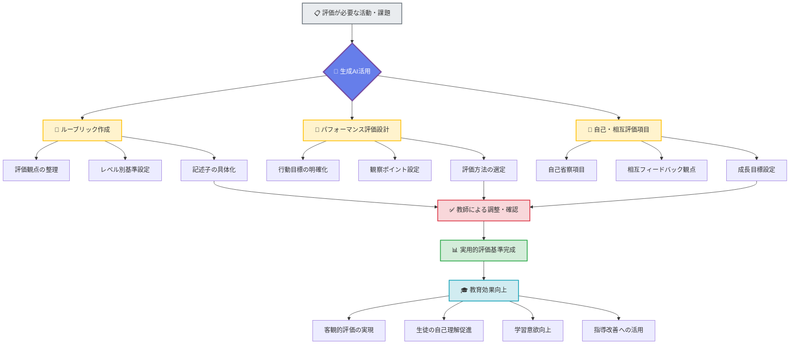

**評価基準設定の3つの活用場面**

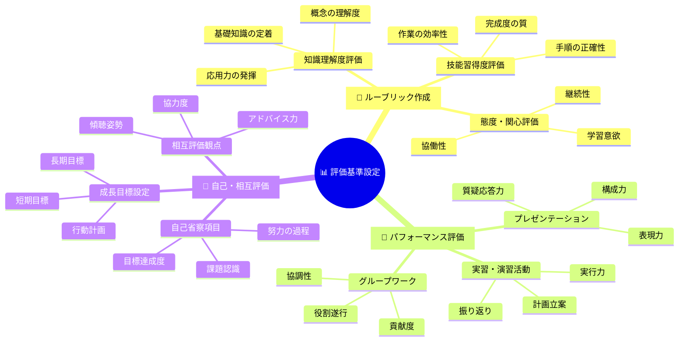

**活用場面の詳細説明**：

**📝 ルーブリック作成**
生成AIを活用することで、教師が一から作成するには時間のかかるルーブリックを短時間で下書きできます。例えば、「簿記実習の評価ルーブリック」を依頼すると、知識・技能・態度の3観点について、「優秀・良好・要改善」の各レベルでの具体的な評価基準が提示されます。教師はこれを基に、自校の実情に合わせた調整を行うことで、効率的に質の高いルーブリックを完成できます。

**🎯 パフォーマンス評価の観点整理**
実践的な活動を重視する商業教育において、パフォーマンス評価は重要な評価方法です。生成AIは、プレゼンテーション、グループワーク、実習活動など、様々な場面での評価観点を体系的に整理し、具体的な評価方法を提案します。例えば、「マーケティング企画発表」の評価では、企画力・プレゼン技術・質疑応答対応など、多面的な評価観点とその判定基準を提示できます。

**👥 自己評価・相互評価の項目設定**
生徒の主体的学習を促進する自己評価・相互評価の項目設定において、生成AIは発達段階に応じた適切な評価項目を提案します。自己省察を深める質問項目から、建設的な相互フィードバックを促す観点まで、生徒の成長を支援する評価システムの構築をサポートします。

**従来の課題と生成AI活用による解決**：
- **作成時間の短縮**: 数日かけていた評価基準作成が数時間で完了
- **観点の体系化**: 漏れのない包括的な評価観点の整理
- **記述の具体化**: 曖昧な表現を避けた明確な評価基準の設定
- **客観性の向上**: 個人的な偏見を排除した公正な評価基準の構築
- **継続的改善**: 評価結果を基にした基準の見直しと改善提案

#### 【演習6】簿記授業の指導案作成プロンプト（5分）

**課題**: 「現金・預金」の授業（50分）の指導案作成プロンプトを作成し、実際にAIに入力してみてください。

**条件設定**：
- 対象：高校1年生（簿記初学者）
- 単元：3級簿記「現金・預金の記帳」
- 目標：現金出納帳と当座預金出納帳の記入ができる
- 使用教材：検定試験の過去問題を活用

**プロンプト作成のヒント**：
1. 役割設定：商業高校の簿記担当教師
2. 具体的指示：50分授業の指導案作成
3. 条件・制約：初学者対象、実習中心、評価場面含む
4. 出力形式：時間配分表、指導のポイント、準備物

**参考プロンプト（基本版）**：
```
あなたは商業高校の簿記担当教師です。
高校1年生（簿記初学者）に対する「現金・預金の記帳」の授業（50分）の学習指導案を作成してください。

【授業の目標】
- 現金出納帳の記入方法を理解し、正確に記帳できる
- 当座預金出納帳の記入方法を理解し、正確に記帳できる
- 現金と預金の管理の重要性を理解する

【条件】
- 対象：高校1年生25名（簿記初学者）
- 時間：50分（導入10分、展開30分、まとめ10分）
- 教材：検定試験過去問題、実習用帳簿
- 重視する点：実践的な記帳練習、理解度の確認

【出力形式】
以下の項目を含む指導案：
1. 本時の目標
2. 時間配分と学習活動
3. 指導上のポイント
4. 評価方法
5. 準備物
```

**参考プロンプト（教育理論適用版）**：
```
あなたは商業高校の簿記担当教師です。
高校1年生（簿記初学者）に対する「現金・預金の記帳」の授業（50分）の学習指導案を作成してください。

【授業の目標】
- 現金出納帳の記入方法を理解し、正確に記帳できる
- 当座預金出納帳の記入方法を理解し、正確に記帳できる
- 現金と預金の管理の重要性を理解する

【条件】
- 対象：高校1年生25名（簿記初学者）
- 時間：50分（導入10分、展開30分、まとめ10分）
- 教材：検定試験過去問題、実習用帳簿
- 重視する点：実践的な記帳練習、理解度の確認

【適用教育理論】
以下の教育理論を踏まえた指導設計：
- 構成主義学習理論：生徒の既有知識（お小遣い帳、家計簿）と新しい学習（簿記記帳）を関連付け
- 認知負荷理論：情報の段階的提示により認知負荷を軽減（現金出納帳→当座預金出納帳）
- 体験学習理論（コルブのサイクル）：具体的体験（記帳実習）→内省的観察（記入結果確認）→抽象的概念化（記帳原理の理解）→能動的実験（類似問題演習）
- 足場かけ理論：教師による段階的支援（一斉指導→ペア活動→個別練習）

【出力形式】
以下の項目を含む指導案：
1. 本時の目標（教育理論との関連も明記）
2. 時間配分と学習活動（各段階での教育理論の適用方法）
3. 指導上のポイント（理論的根拠を含む）
4. 評価方法（形成的評価・総括的評価の観点）
5. 準備物
```

**参考プロンプト（教育理論自動選択版）**：
```
あなたは教育学と商業教育の専門家です。
商業高校1年生（簿記初学者）に対する「現金・預金の記帳」の授業（50分）について、最適な教育理論を選択・適用した学習指導案を作成してください。

【授業の目標】
- 現金出納帳の記入方法を理解し、正確に記帳できる
- 当座預金出納帳の記入方法を理解し、正確に記帳できる
- 現金と預金の管理の重要性を理解する

【条件】
- 対象：高校1年生25名（簿記初学者）
- 時間：50分（導入10分、展開30分、まとめ10分）
- 教材：検定試験過去問題、実習用帳簿
- 重視する点：実践的な記帳練習、理解度の確認

【教育理論選択・適用の指示】
以下の手順で学習指導案を作成してください：

ステップ1: 教育理論の選択
- この授業内容・対象・目標に最も適した教育理論を3～4つ選択
- 選択理由を具体的に説明
- 各理論の簿記教育への適用可能性を分析

ステップ2: 理論の統合的適用
- 選択した理論を授業の各段階（導入・展開・まとめ）に効果的に配置
- 理論間の相乗効果を考慮した指導方法を設計
- 生徒の学習プロセスに沿った理論適用を計画

ステップ3: 指導案の作成
- 理論的根拠を明確にした具体的な指導案を作成
- 各活動における理論の働きを詳述
- 評価方法も理論に基づいて設計

【出力形式】
以下の構成で出力してください：
1. 選択した教育理論とその根拠（各理論300文字程度）
2. 理論の統合的適用方針（400文字程度）
3. 本時の目標（理論との関連明記）
4. 時間配分と学習活動（各段階での理論適用方法詳述）
5. 指導上のポイント（理論的根拠を含む）
6. 評価方法（理論に基づく形成的評価・総括的評価）
7. 準備物
8. 理論適用の効果予測と改善点
```

**教育理論との融合のメリット**

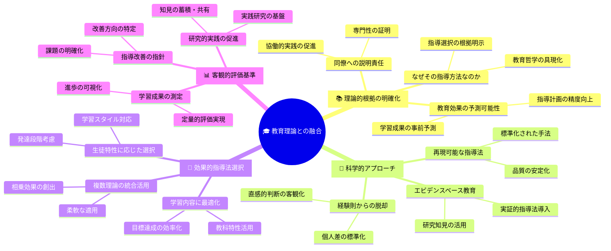

**具体的なメリットの詳細説明**：

**📚 理論的根拠の明確化**
教育理論を組み込むことで、「なぜその指導方法を選択するのか」が明確になります。例えば、構成主義学習理論に基づいて既有知識との関連付けを重視する理由や、認知負荷理論に基づいて情報を段階的に提示する根拠が説明できるようになります。これにより、教師自身の指導に対する確信が深まり、生徒や同僚に対する説明責任も果たせます。

**🔬 科学的アプローチの導入**
経験や直感に頼った指導から、研究に裏付けられた科学的アプローチへの転換が図れます。生成AIが提案する教育理論は、多くの研究によって効果が実証されたものであり、エビデンスベースの教育実践を実現できます。また、同じ理論を適用すれば類似の効果が期待できるため、再現可能な指導法の確立につながります。

**🎯 効果的指導法の選択**
生徒の特性（学習スタイル、既有知識レベル、発達段階）や学習内容の性質に応じて、最も適した教育理論を選択できます。例えば、実習中心の授業では体験学習理論を、概念理解が必要な場面では認知的学習理論を適用するなど、状況に応じた最適化が可能になります。

**📊 客観的評価基準の設定**
教育理論に基づいた評価基準により、主観的判断を排除した客観的な学習成果の測定が可能になります。理論が示す学習プロセスに沿った形成的評価の設計や、理論的に予測される学習成果に基づく総括的評価の実施により、より精密で公正な評価が実現できます。

**従来の課題と教育理論融合による解決**：
- **根拠不明確**: 指導方法の選択理由が明確になる
- **経験頼み**: 科学的根拠に基づく指導への転換
- **効果予測困難**: 理論に基づく教育効果の予測可能性向上
- **評価の主観性**: 客観的で体系的な評価基準の構築
- **指導の一貫性**: 理論的枠組みによる安定した指導品質の確保

### 3.2 教材作成支援（10分）

#### 練習問題の自動生成
検定試験対策や理解度確認のための練習問題を効率的に作成できます。

**活用パターン**：
1. **基礎練習問題**：概念理解を確認する選択問題
2. **応用問題**：複数の知識を統合する計算問題
3. **発展問題**：思考力を問う論述問題
4. **検定対策問題**：過去問レベルの実践問題

**問題生成のコツ**：
- 難易度レベルの明確化
- 出題範囲の限定
- 解答・解説の詳細化
- バリエーションの確保

#### 事例研究の作成
実際の企業事例を基にした教材で、実践的な学習を促進します。

**事例作成のポイント**：
- 身近で理解しやすい企業選択
- 最新の情報に基づく内容
- 生徒の考察を促す設問設計
- 複数の視点からの分析

#### 図表・資料の説明文作成
統計データやグラフの読み取り指導で活用します。

**説明文作成の要素**：
- データの概要説明
- 主要な傾向の指摘
- 背景要因の分析
- 今後の予測・課題

#### 【演習7】マーケティング事例問題の作成（5分）

**課題**: 身近な企業のマーケティング戦略を題材とした事例問題を作成してください。

**作成要件**：
- 対象：高校2年生
- 企業：日本の身近な企業（例：コンビニ、ファストフード等）
- 学習単元：「商品戦略」
- 問題形式：事例読解＋考察問題3問
- 時間：20分程度で解答可能

**推奨プロンプト（基本版）**：
```
あなたはマーケティング教育の専門家です。
商業高校2年生向けの「商品戦略」に関する事例問題を作成してください。

【条件】
- 企業：日本の身近な企業から1社選択
- 事例内容：その企業の代表的な商品戦略
- 問題数：考察問題3問
- 解答時間：20分程度
- 難易度：高校生が取り組みやすいレベル

【構成】
1. 企業・商品の概要（200文字程度）
2. 商品戦略の具体的内容（400文字程度）
3. 考察問題3問（各100文字程度の解答を想定）
4. 解答例・解説

【重視する点】
- 生徒の身近な体験と関連付け
- マーケティング理論の実践的理解
- 批判的思考力の育成
```

**推奨プロンプト（教育理論自動選択版）**：
```
あなたはマーケティング教育と教育学の専門家です。
商業高校2年生向けの「商品戦略」に関する事例問題について、最適な教育理論を選択・適用して作成してください。

【条件】
- 企業：日本の身近な企業から1社選択
- 事例内容：その企業の代表的な商品戦略
- 問題数：考察問題3問
- 解答時間：20分程度
- 難易度：高校生が取り組みやすいレベル
- 対象：商業高校2年生（マーケティング基礎知識あり）

【教育理論選択・適用の指示】
以下の手順で事例問題を作成してください：

ステップ1: 教育理論の選択
- 事例学習・問題解決学習に適した教育理論を2～3つ選択
- 選択理由と理論の特徴を説明
- 各理論のマーケティング教育への適用効果を分析

ステップ2: 理論に基づく問題設計
- 選択した理論に基づき、思考プロセスを促進する問題を設計
- 生徒の認知的・情意的発達を考慮した問題構成
- 理論的根拠に基づく難易度設定と段階的思考促進

ステップ3: 評価観点の理論的設定
- 選択した教育理論に基づく評価観点の設定
- 知識・技能・思考力・判断力の統合的評価方法
- 理論に基づく解答例・解説の作成

【構成】
1. 選択した教育理論とその根拠（各理論200文字程度）
2. 理論に基づく問題設計方針（300文字程度）
3. 企業・商品の概要（200文字程度）
4. 商品戦略の具体的内容（400文字程度）
5. 考察問題3問（理論的根拠を明記した設問設計）
6. 解答例・解説（理論に基づく評価観点含む）
7. 指導上のポイント（理論適用の注意点）
8. 発展的学習への展開方法（理論に基づく）

【重視する点】
- 選択した教育理論の効果的適用
- 生徒の思考プロセスの段階的発達
- 理論と実践の統合的理解促進
- 批判的思考力と創造的思考力の育成
```

**推奨プロンプト（改定版Bloom's Taxonomy準拠版）**：
```
あなたはマーケティング教育の専門家です。
改定版ブルームの教育目標分類学（Bloom's Taxonomy 2001年版）に基づいて、商業高校2年生向けの「商品戦略」に関する体系的な事例問題を作成してください。

【条件】
- 企業：日本の身近な企業から1社選択
- 事例内容：その企業の代表的な商品戦略
- 問題数：6問（各認知プロセス次元から1問ずつ）
- 解答時間：30分程度
- 難易度：高校2年生レベル（段階的に高次思考へ）
- 対象：商業高校2年生（マーケティング基礎知識あり）

【改定版Bloom's Taxonomyの適用指示】
以下の認知プロセス次元に沿って問題を体系的に設計してください：

【認知プロセス次元】（低次思考→高次思考）
1. 記憶する（Remember）：基礎的事実・用語の想起
2. 理解する（Understand）：概念・原理の説明・解釈
3. 適用する（Apply）：学習した知識・技能の具体的場面での使用
4. 分析する（Analyze）：要素分解・関係性の特定・構造の明確化
5. 評価する（Evaluate）：基準に基づく判断・批判的検討
6. 創造する（Create）：新しいアイデア・解決策の生成・統合

【知識次元】との組み合わせ
- 事実的知識：基本用語、具体的詳細
- 概念的知識：分類、原理、理論、構造
- 手続き的知識：技法、方法、基準
- メタ認知的知識：戦略意識、文脈的知識

【問題設計の指示】
各認知プロセス次元について：
- 問題文で使用する動詞を明確に指定（例：記憶→「定義せよ」、創造→「提案せよ」）
- 知識次元との適切な組み合わせを考慮
- 段階的な思考の発達を促進する構成
- マーケティング理論との関連を明示

【構成】
1. 改定版Bloom's Taxonomyの適用方針（400文字程度）
2. 企業・商品の概要（200文字程度）
3. 商品戦略の具体的内容（400文字程度）
4. 体系的問題設計：
   - 問題1（記憶）：○○を定義/列挙せよ
   - 問題2（理解）：○○を説明/要約せよ
   - 問題3（適用）：○○を適用/実行せよ
   - 問題4（分析）：○○を分析/比較せよ
   - 問題5（評価）：○○を評価/判断せよ
   - 問題6（創造）：○○を創造/提案せよ
5. 各問題のTaxonomy上の位置づけと設計意図
6. 解答例・評価基準（認知プロセス次元別）
7. 指導上のポイント（思考の段階的発達支援）
8. 発展的学習への展開（高次思考力育成）

【重視する点】
- 認知プロセスの段階的発達促進
- 知識次元との適切な組み合わせ
- 高次思考力（分析・評価・創造）の重点的育成
- メタ認知能力の向上支援
- 理論と実践の統合的理解
```

### 3.3 学生サポート（10分）

#### 個別指導用フィードバック生成
生徒一人ひとりの学習状況に応じた個別フィードバックを作成します。

**フィードバック作成の観点**：
1. **良い点の具体的指摘**：成果の認識と自信向上
2. **改善点の建設的提示**：次への取り組み意欲喚起
3. **具体的アドバイス**：実行可能な改善方法
4. **激励メッセージ**：継続学習への動機付け

**個別対応のメリット**：
- 生徒の特性に応じたきめ細かい指導
- 時間効率的な個別サポート
- 客観的で公正な評価コメント

#### 進路指導資料の作成
生徒の進路選択支援のための情報提供資料を作成します。

**作成する資料例**：
- 業界研究資料
- 職業紹介パンフレット
- 進学情報まとめ
- 資格取得ガイド

**進路指導での活用ポイント**：
- 最新の労働市場情報
- 具体的なキャリアパス
- 必要な資格・スキル
- 実際の体験談・事例

#### 保護者向け説明資料
保護者の理解と協力を得るための資料作成に活用します。

**説明資料の内容例**：
- 商業教育の意義と特徴
- 資格取得の重要性
- 進路選択のポイント
- 家庭学習の支援方法

#### 【演習8】生徒の作品評価コメント生成（5分）

**課題**: 以下の生徒作品に対する評価コメントを生成してください。

**設定**：
- 科目：ビジネス基礎
- 課題：「地元企業紹介レポート」（A4用紙2枚）
- 生徒：高校1年生（商業科目初学者）
- 作品の特徴：企業選択は良いが、分析が浅い、文章表現に課題

**プロンプト例**：
```
あなたは商業高校のビジネス基礎担当教師です。
高校1年生の「地元企業紹介レポート」に対する評価コメントを作成してください。

【生徒の作品状況】
- 企業選択：地元の有名製造業を選択（適切）
- 情報収集：企業HPや新聞記事を活用（良好）
- 分析内容：基本情報の整理はできているが、分析が表面的
- 文章表現：誤字脱字が数箇所、論理構成に改善の余地

【評価コメントの要件】
- 良い点を3つ以上具体的に指摘
- 改善点を2つ程度建設的に提示
- 次回への具体的アドバイス
- 前向きで励ましのトーン
- 200文字程度

【重視する観点】
- 生徒の成長を促進する内容
- 自己肯定感を維持しながら向上心を刺激
- 具体的で実行可能な改善提案
```

### 3.4 業務効率化（5分）

#### 会議資料の作成
教員の負担軽減につながる事務作業の効率化を図ります。

**活用場面**：
- 教科会議の議事資料
- 学年会議の提案資料
- 研修会の企画書
- 学校評価の分析資料

#### 報告書の下書き作成
各種報告書の構成案や下書きを作成し、教員の本来業務に集中できる時間を確保します。

**報告書の種類**：
- 授業実践報告
- 研修参加報告
- 学習状況分析報告
- 進路指導実績報告

#### メール文面の作成
保護者や関係機関への連絡文書作成を効率化します。

**メール作成の活用例**：
- 保護者への定期連絡
- 進路説明会の案内
- 検定試験の申込み案内
- 学校行事の連絡事項

**業務効率化のメリット**：
- 教材研究や生徒指導により多くの時間を配分
- 質の高い教育活動への集中
- ワークライフバランスの改善

---

## 第4部：高度なプロンプト技術（10分）

### 4.1 チェーン・オブ・ソート（思考の連鎖）（3分）

#### 段階的思考を促す技術
複雑な問題を段階的に分析・解決するための技術です。

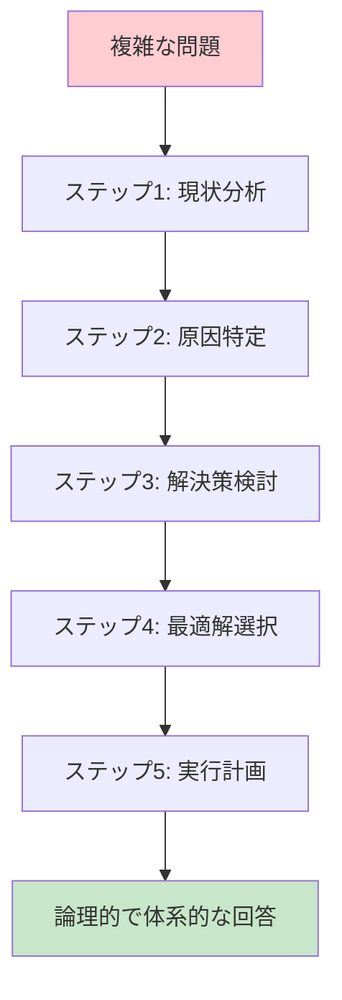

**基本的な使い方**：
```
以下の手順で段階的に考えてください：
ステップ1: [最初の分析]
ステップ2: [次の分析]
ステップ3: [最終的な結論]
```

**商業教育での活用例**：
```
商業高校生の進路選択について、以下のステップで分析してください：
ステップ1: 現在の労働市場の状況を分析
ステップ2: 商業高校生に求められるスキルを特定
ステップ3: 具体的な進路選択肢を提示
ステップ4: 各選択肢のメリット・デメリットを比較
ステップ5: 最適な進路選択の指針を提案
```

#### 「ステップバイステップで考えて」の効果
この指示により、AIがより論理的で体系的な回答を生成します。

**効果**：
- 論理的な思考プロセスの可視化
- 複雑な問題の段階的解決
- 学習者の理解促進
- 教師の指導指針明確化

### 4.2 ロールプレイング技術（4分）

#### 専門家の視点を活用
AIに特定の専門家の役割を与えることで、専門性の高い回答を得られます。

**商業教育での専門家役割例**：
- 公認会計士（会計・監査の視点）
- 中小企業診断士（経営分析の視点）  
- キャリアコンサルタント（進路指導の視点）
- マーケティング専門家（市場分析の視点）

**ロールプレイング活用例**：
```
あなたは中小企業診断士として、以下の企業の財務状況を分析し、
商業高校生が理解できるレベルで改善提案を行ってください。
[企業の財務データ]
```

#### 複数の立場からの検討
同じ問題を異なる立場から検討することで、多角的な理解を促進します。

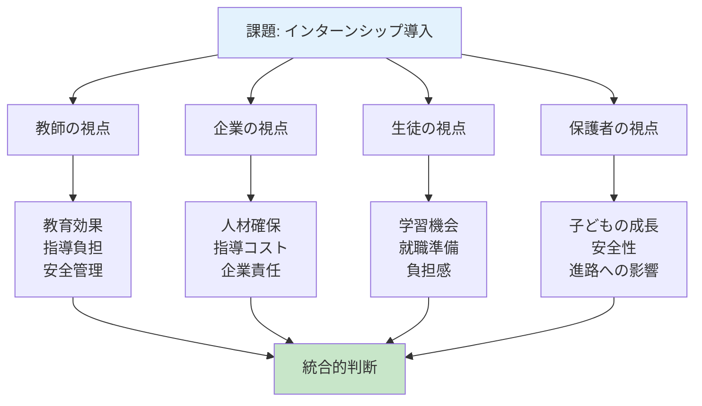

**複数視点の例**：
```
地元企業でのインターンシップ導入について、
以下の立場からそれぞれ意見を述べてください：
1. 高校教師の立場
2. 企業経営者の立場  
3. 生徒の立場
4. 保護者の立場
```

### 4.3 制約条件の活用（3分）

#### 文字数制限、形式指定
適切な制約を設けることで、実用的な成果物を得られます。

**制約の種類**：
- **分量制約**：「300文字以内」「A4用紙1枚」
- **時間制約**：「5分で説明可能」「50分授業用」
- **形式制約**：「箇条書きで」「表形式で」「会話形式で」

#### 対象者レベルの調整
対象者のレベルを明確に指定することで、適切な難易度の内容を得られます。

**レベル指定の例**：
- 「中学生でも理解できるレベルで」
- 「検定2級レベルの知識を前提として」
- 「大学進学希望者向けの発展的内容で」

**制約活用の実例**：
```
簿記の「減価償却」について、
高校1年生が10分で理解できる説明を、
身近な例を使って、
300文字以内で、
会話形式で作成してください。
```

---

## 第5部：実践とまとめ（5分）

### 5.1 総合演習（3分）

#### 自分の担当科目でのプロンプト作成
これまで学んだ技術を活用して、実際の教育現場で使用できるプロンプトを作成します。

**演習の進め方**：
1. **担当科目・単元の選択**（30秒）
2. **プロンプトの設計**（2分）
3. **ペアでの評価・改善**（30秒）

**作成のポイント**：
- 5W1Hの明確化
- 4つの構造要素の組み込み
- 具体的な制約条件の設定
- 実用性の重視

#### ペアでのプロンプト評価・改善
隣の参加者とプロンプトを交換し、以下の観点で評価・改善提案を行います。

**評価観点**：
- [ ] 役割設定が明確か
- [ ] タスク指示が具体的か
- [ ] 制約条件が適切か
- [ ] 出力形式が明確か
- [ ] 実際の授業で使用可能か

### 5.2 今後の学習指針（2分）

#### 継続的な改善のポイント

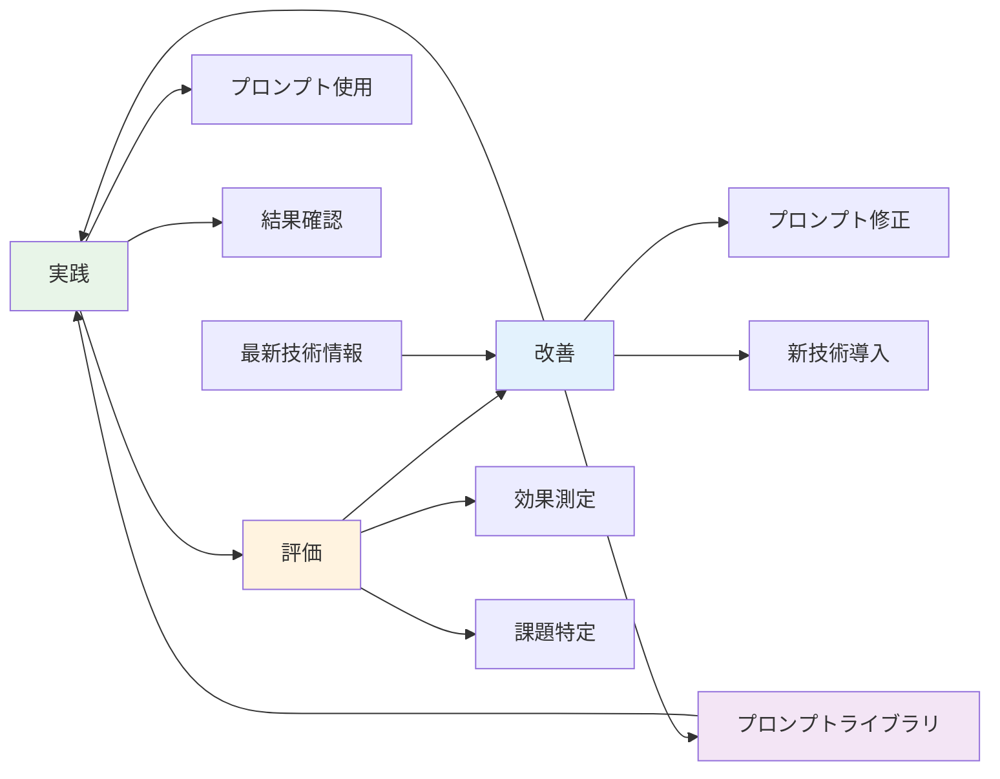

1. **実践→評価→改善のサイクル**
   - 作成したプロンプトを実際に使用
   - 結果を評価・分析
   - より良いプロンプトに改善

2. **プロンプトライブラリの構築**
   - 効果的なプロンプトを蓄積
   - 科目・単元別に整理
   - 同僚との共有・活用

3. **最新技術への対応**
   - 生成AIの機能向上に注目
   - 新しいプロンプト技術の習得
   - 教育への適用可能性の検討

#### 校内での共有・活用方法
1. **教科内での情報共有**
   - 効果的なプロンプトの共有
   - 実践事例の蓄積
   - 課題・改善点の検討

2. **学校全体での活用推進**
   - 研修会の企画・実施
   - 活用ガイドラインの策定
   - 成果事例の発表・共有

3. **継続的な研修体制**
   - 定期的な勉強会開催
   - 外部講師による研修
   - 他校との情報交換

---

## セミナー後の実践計画

### 即座に取り組めること（今日から1週間）
- [ ] 自分の担当科目で1つのプロンプトを作成・試用
- [ ] 配布されたプロンプト集から3つを実践
- [ ] 同僚1名と今日の学習内容を共有

### 1ヶ月以内の目標
- [ ] 5つ以上のプロンプトを授業で活用
- [ ] 効果的だったプロンプトを記録・整理
- [ ] 教科内でプロンプト活用事例を共有

### 3ヶ月以内の目標
- [ ] オリジナルプロンプト集（10個以上）を作成
- [ ] 他の教員にプロンプト技術を指導
- [ ] 学校全体でのAI活用推進に貢献

---

## よくある質問（FAQ）

### Q1: 生成AIを使うことで、教師の指導力が低下しませんか？
**A**: 生成AIは「指導力の代替」ではなく「指導力の拡張」ツールです。教材作成や事務作業の効率化により、生徒と向き合う時間や教材研究の時間を増やすことができます。

### Q2: AIが作成した内容をそのまま使用しても問題ありませんか？
**A**: AIの出力は必ず確認・修正が必要です。事実確認、教育的配慮、著作権等の観点から、教師の専門的判断を加えて使用してください。

### Q3: 費用はどの程度かかりますか？
**A**: Edge Copilotは教育機関向けライセンスで無償で利用できます。Word, Excel, PowerPoint, Teams上でCopilotを使用したい場合は、Microsoft 365 Copilotライセンスを購入する必要があります。

### Q4: 生徒がAIを不適切に使用することを心配しています。
**A**: 発達段階によって注意事項が異なります。高等学校では以下の点に注意して指導してください。

**高校生特有の注意点**：
- **学習の主体性確保**：AIに依存せず、自分で考える習慣を維持させる
- **進路選択への影響**：AIの回答を鵜呑みにせず、複数の情報源で確認する重要性を指導
- **情報リテラシー**：AI生成情報の信頼性判断能力を育成
- **著作権・プライバシー**：個人情報や機密情報をAIに入力しない指導を徹底
- **学習目標との整合**：検定試験や入試では自力で解答する必要があることを明確化
- **倫理的使用**：レポートや課題でのAI使用ルールを明確に設定

**指導のポイント**：
1. AI活用のメリット・デメリットを客観的に説明
2. 適切な使用場面と不適切な使用場面を具体例で示す
3. 批判的思考力と情報活用能力の育成を重視
4. 将来の職業生活でのAI活用を見据えた指導

### Q5: 技術的な知識がないのですが、大丈夫でしょうか？
**A**: 特別な技術知識は不要です。今日学んだプロンプト作成技術があれば、十分に活用できます。継続的な実践で徐々に上達していきます。

---

## 配布資料一覧

1. **プロンプト基本テンプレート集**
   - [5W1H確認シート](./templates/5W1H_confirmation_sheet.md)
   - [4要素構造テンプレート](./templates/4_elements_structure_template.md)
   - [科目別基本プロンプト](./templates/subject_basic_prompts.md)

2. **商業教育分野別プロンプト事例集**
   - [簿記・会計分野（15例）](./examples/bookkeeping_prompt_examples.md)
   - [マーケティング分野（10例）](./examples/marketing_prompt_examples.md)
   - [情報処理分野（8例）](./examples/it_prompt_examples.md)
   - [ビジネス基礎分野（7例）](./examples/business_basics_prompt_examples.md)

3. **プロンプト評価チェックリスト**
   - [明確性・構造化・教育的配慮チェック項目](./tools/prompt_evaluation_checklist.md)

4. **継続学習ガイド**
   - [実践記録シート](./tools/practice_record_sheet.md)
   - [改善アクションプラン](./tools/improvement_action_plan.md)

---

## 最後に

**教育のAI活用 - 4つの核心要素**

### 🔧 **技術は手段**
- 効率化ツール
- アイデア生成支援
- 作業負担軽減

### 🎯 **教育は目的**
- 生徒の成長
- 学習効果向上
- 人間性の育成

### 🎓 **教師の専門性**
- 教育経験
- 教科専門知識
- 生徒理解力

### ❤️ **人間的温かさ**
- 共感力
- コミュニケーション力
- 個別配慮

生成AIは教育を変革する強力なツールですが、最も重要なのは「教師の専門性と人間的な温かさ」です。今日学んだプロンプト技術を活用して、より質の高い教育を生徒たちに提供していただけることを期待しています。

### 核心理念

🛠️ **技術は手段** ➕ 🎓 **教育は目的** = 🌱 **より良い教育** → 🎆 **生徒の成長と成功**

**「技術は手段、教育は目的」**

この理念を忘れずに、生成AIを教育現場で効果的に活用し、生徒たちの成長と成功を支援していきましょう。

---

**[セミナー終了後のアンケート](./seminar_survey.html)にもご協力をお願いいたします。**