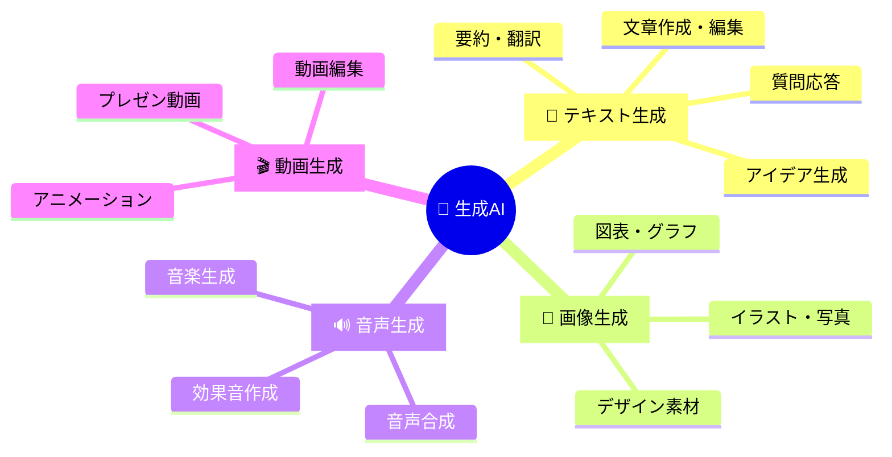
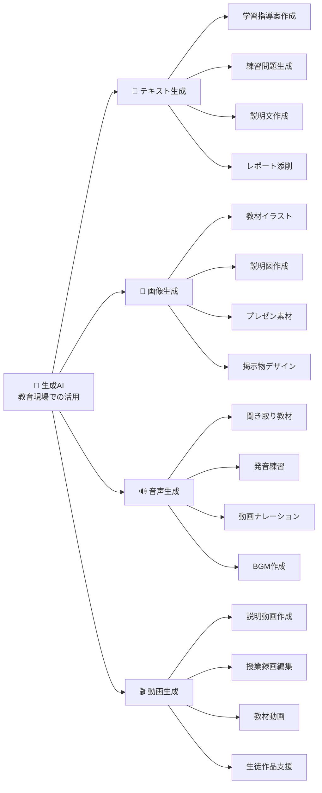
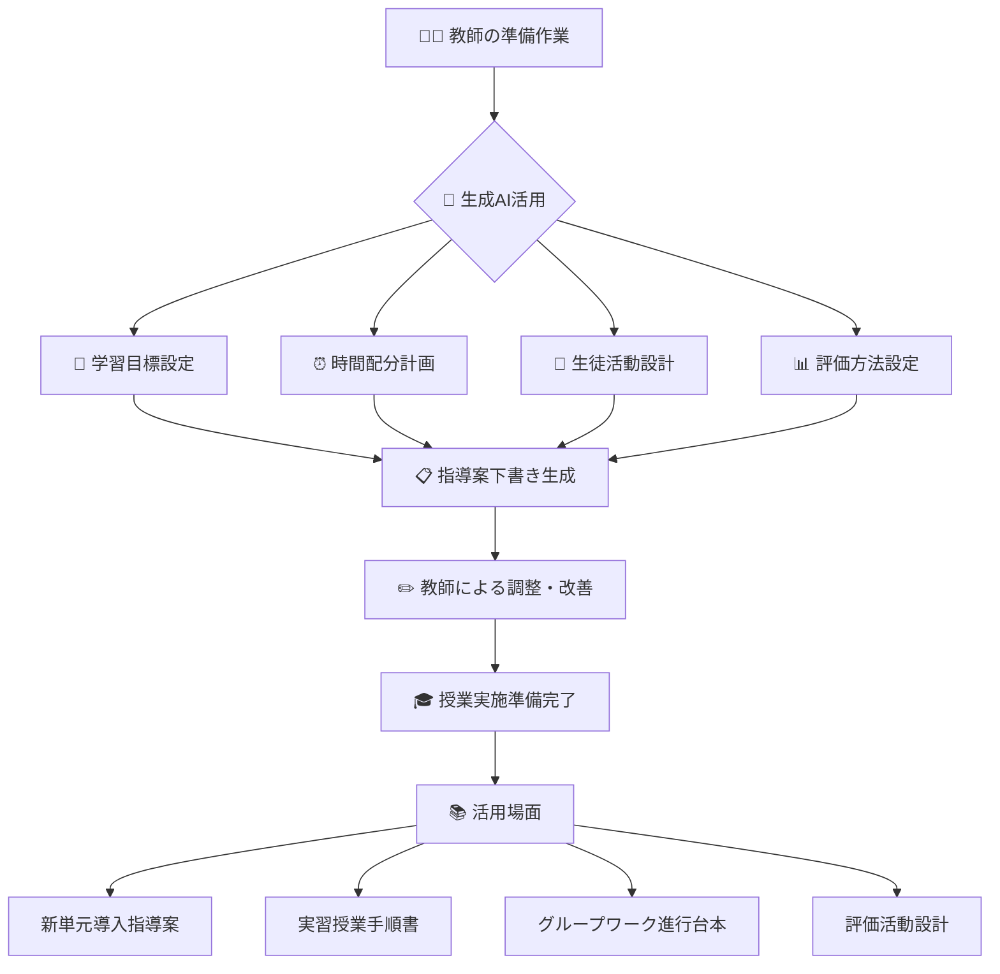
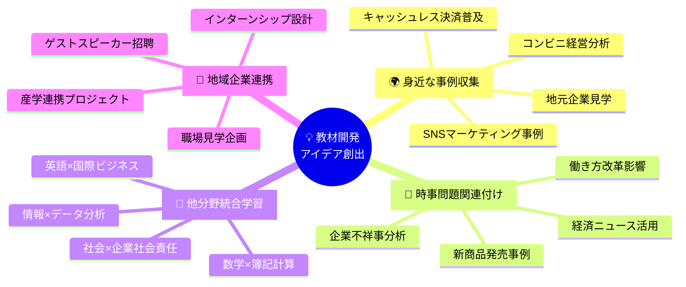
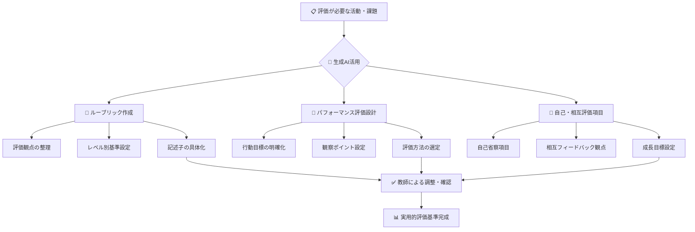
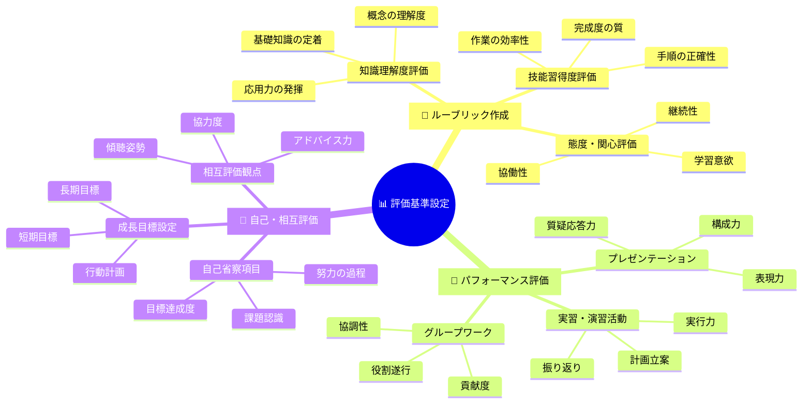
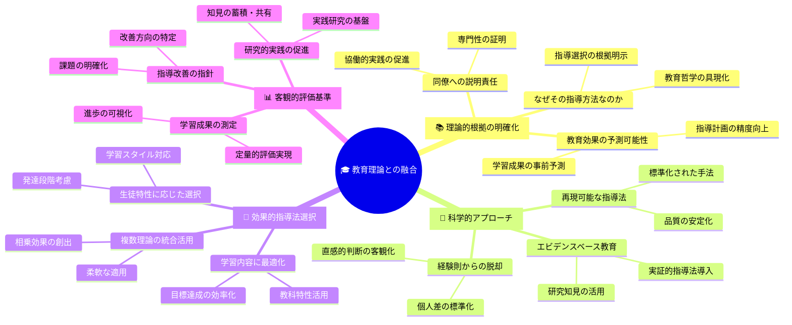

<script src="https://cdn.jsdelivr.net/npm/mermaid@10.6.1/dist/mermaid.min.js"></script>
<script>
mermaid.initialize({
  startOnLoad: true,
  theme: 'default',
  themeVariables: {
    primaryColor: '#667eea',
    primaryTextColor: '#fff',
    primaryBorderColor: '#764ba2',
    lineColor: '#667eea',
    secondaryColor: '#f8f9fa',
    tertiaryColor: '#e9ecef'
  }
});
</script>

# 商業高等学校教員向け
## 生成AI利活用セミナー

### プロンプトエンジニアリングの基礎から実践まで

---

## セミナーの目的

### 生成AIを教育現場で効果的に活用
- **プロンプトエンジニアリング**の基礎習得
- 日々の教育活動の**効率化**
- 教育の**質向上**

### 対象者
- 商業高等学校の教員（初心者大歓迎）
- 簿記、会計、マーケティング、情報処理、ビジネス基礎担当
- ICT活用教育に興味のある先生方

---

## セミナータイムライン（90分）

<div class="agenda">
  <div class="agenda-item">
    <h4>0-15分</h4>
    <p><strong>第1部</strong><br>基礎理解</p>
    <small>生成AI概要・プロンプト基本概念</small>
  </div>
  <div class="agenda-item">
    <h4>15-40分</h4>
    <p><strong>第2部</strong><br>基本原則</p>
    <small>明確性・構造化・文脈提供</small>
  </div>
  <div class="agenda-item">
    <h4>40-75分</h4>
    <p><strong>第3部</strong><br>実践活用</p>
    <small>授業設計・教材作成・学生サポート</small>
  </div>
  <div class="agenda-item">
    <h4>75-85分</h4>
    <p><strong>第4部</strong><br>高度技術</p>
    <small>高度プロンプト技術</small>
  </div>
  <div class="agenda-item">
    <h4>85-90分</h4>
    <p><strong>第5部</strong><br>まとめ</p>
    <small>実践・まとめ</small>
  </div>
</div>

---

# 第1部：生成AIとプロンプトの基礎理解
## （15分）

---

## 生成AIとは何か？

### 定義
**生成AI（Generative AI）**とは、テキスト、画像、音声などの新しいコンテンツを人工的に生成する技術

### 主要サービス
- **Microsoft Copilot** (Microsoft)
- **ChatGPT** (OpenAI)
- **Claude** (Anthropic) 
- **Gemini** (Google)

---

## 生成AIの種類と機能



---

## 教育現場での活用例



---

## プロンプトとは？

### プロンプト = AIへの指示書

<div class="bad-example">

**❌ 悪いプロンプト例**
```
簿記について教えて
```

</div>

<div class="good-example">

**✅ 良いプロンプト例**
```
あなたは商業高校の簿記担当教師です。
高校1年生（簿記初心者）に向けて、
「資産・負債・純資産」の概念を、
身近な例を使って分かりやすく5分で説明できる内容を、
話し言葉で300文字程度で作成してください。
```

</div>

---

## プロンプトの品質による結果の違い

| プロンプトの種類 | 入力例 | 出力の特徴 | 実用性 |
|-----------------|--------|------------|--------|
| ❌ **曖昧なプロンプト** | 簿記について教えて | 基本的な説明のみ<br/>すぐには使えない | **低** |
| ✅ **具体的なプロンプト** | 高校1年生向け<br/>5分で説明可能<br/>身近な例を使用<br/>300文字程度 | 授業ですぐ使える<br/>具体的な内容<br/>適切な分量 | **高** |

**重要**: プロンプトの書き方によって出力の質が大きく変わります

---

## 【体験コーナー】プロンプトを試してみましょう

<div class="exercise">

### 演習1: 基本的なプロンプト
```
商業高校のマーケティング授業で使える、
身近な企業の成功事例を1つ教えてください。
```

### 演習2: 詳細なプロンプト
```
あなたは商業高校のマーケティング教師です。
高校2年生に「ターゲティング戦略」を教える際に使用する、
日本の身近な企業（コンビニ、ファーストフード等）の具体的成功事例を、
以下の構成で800文字程度で作成してください：
1. 企業名と概要
2. ターゲティング戦略の内容
3. 成功要因の分析
4. 生徒への質問（考察ポイント）
```

</div>

---

# 第2部：プロンプト設計の基本原則
## （25分）

---

## 明確性の原則

### Role+5W1H を意識した指示

| 要素 | 内容 | 具体例 |
|------|------|--------|
| **Role**（役割） | AIに求める専門性・立場 | 簿記教師、キャリアカウンセラー、企業経営者 |
| **Who**（誰が） | 対象者・読み手 | 高校1年生、保護者、同僚教師 |
| **What**（何を） | 作成する内容 | 学習指導案、練習問題、説明資料 |
| **When**（いつ） | 時期・タイミング | 新学期、中間試験前、進路指導時期 |
| **Where**（どこで） | 使用場面・環境 | 教室、実習室、保護者会 |
| **Why**（なぜ） | 目的・理由 | 理解促進、動機付け、技能習得 |
| **How**（どのように） | 方法・形式 | 講義形式、グループワーク、個別指導 |

---

## 構造化の原則

### 効果的なプロンプトの4つの構造要素

#### 🎯 **1. 役割設定**
- あなたは○○の専門家です
- 専門的視点の付与
- 適切な回答レベル設定

#### 📋 **2. タスク指示**
- ××について△△してください
- 具体的な動作指示
- 明確な成果物の指定

#### ⚙️ **3. 条件・制約**
- 対象者・レベル
- 時間・分量制約
- 使用場面・目的

#### 📄 **4. 出力形式**
- 文字数・構成
- 出力フォーマット
- 必要項目の指定

---

## 【演習】曖昧な指示を明確にする練習

<div class="exercise">

### 課題: 次の曖昧なプロンプトを改善してください
```
原価計算について説明してください。
```

### 改善のポイント
- **Role**: AIにどの専門家の立場で回答してもらうか？
- **Who**: 対象者は？（学年、既習レベル）
- **What**: 原価計算のどの部分？
- **Why**: なぜ学ぶのか？
- **How**: どのような形式で？

</div>

---

## 改善例

<div class="good-example">

```
あなたは商業高校の原価計算担当教師です。

高校3年生〈簿記2級を学習済み〉に向けて、オーダーメイド家具製造を例に
「個別原価計算」の基本的な流れを10分で説明できる原稿を作成してください。

- 話し言葉で約600文字
- 工程ごとの原価集計 → 仕掛品勘定への振替 → 製品完成までを順序立てて解説
- 専門用語は平易に補足
- 終わりに「ここまでで疑問はある？」など理解確認の問いかけを1行入れる
```

</div>

---

# 第3部：商業教育での実践的活用
## （35分）

---

## 商業教育でのAI活用 - 4つの実践領域

## 🎓 **授業設計支援**
- 学習指導案作成
- 評価基準設定
- 教材開発アイデア

## 📚 **教材作成支援**
- 練習問題生成
- 事例研究作成
- 説明文作成

## 👨‍🎓 **学生サポート**
- 個別フィードバック
- 進路指導資料
- 保護者向け資料

## ⚡ **業務効率化**
- 会議資料作成
- 報告書下書き
- メール文面作成

---

## 学習指導案の作成補助

### 学習指導案作成プロセス



---

## 教材開発のアイデア出し

### 教材開発アイデア創出プロセス



---

## 教材開発の効率化効果

### 🌍 身近な事例の収集
「コンビニの売上向上策」について質問すると、立地戦略、商品陳列、顧客分析、デジタル活用など多角的な事例が提示される

### 📰 時事問題との関連付け
働き方改革の影響を簿記や経営分析の授業に取り入れる方法など、時事性のある実践的な学習機会を創出

### 🔗 他分野との統合的学習
数学の統計と商業のマーケティングデータ分析を組み合わせた授業設計など、教科横断的な深い学びを実現

### 🏢 地域企業との連携方法
地元企業の協力を得たプロジェクト学習の企画から、インターンシップの教育的効果を最大化する指導方法まで

---

## 評価基準の設定支援

### 評価基準設定プロセス



---

## 評価基準設定の3つの活用場面



---

## 教育理論との融合のメリット



---

## 【演習】簿記授業の指導案作成

<div class="exercise">

### 課題
「現金・預金」の授業（50分）の指導案作成プロンプトを作成してください

### 条件設定
- **対象**: 高校1年生（簿記初学者）
- **単元**: 3級簿記「現金・預金の記帳」
- **目標**: 現金出納帳と当座預金出納帳の記入ができる
- **使用教材**: 検定試験の過去問題を活用

### プロンプト作成のヒント
1. 役割設定：商業高校の簿記担当教師
2. 具体的指示：50分授業の指導案作成
3. 条件・制約：初学者対象、実習中心、評価場面含む
4. 出力形式：時間配分表、指導のポイント、準備物

</div>

---

# 第4部：高度なプロンプト技術
## （10分）

---

## チェーン・オブ・ソート（思考の連鎖）

### 段階的思考を促す技術

**🔴 複雑な問題**
⬇️
**🔷 ステップ1: 現状分析**
⬇️
**🔷 ステップ2: 原因特定**
⬇️
**🔷 ステップ3: 解決策検討**
⬇️
**🔷 ステップ4: 最適解選択**
⬇️
**🔷 ステップ5: 実行計画**
⬇️
**🟢 論理的で体系的な回答**

---

## ロールプレイング技術

### 多角的視点の例

#### 🎯 **課題**: インターンシップ導入

| 立場 | 視点 | 主な関心事 |
|------|------|----------|
| 👨‍🏫 **教師** | 教育効果<br/>指導負担<br/>安全管理 | 具体的な教育成果を上げられるか |
| 🏢 **企業** | 人材確保<br/>指導コスト<br/>企業責任 | 将来の採用につながるか |
| 👨‍🎓 **生徒** | 学習機会<br/>就職準備<br/>負担感 | 実際の仕事体験ができるか |
| 👪 **保護者** | 子どもの成長<br/>安全性<br/>進路への影響 | 子どもにとってプラスになるか |

**🔄 結果**: 統合的判断でバランスの取れた解決策を導出

---

## 制約条件の活用

### 文字数制限、形式指定

**制約の種類**:
- **分量制約**: 「300文字以内」「A4用紙1枚」
- **時間制約**: 「5分で説明可能」「50分授業用」
- **形式制約**: 「箇条書きで」「表形式で」「会話形式で」

### 対象者レベルの調整
- 「中学生でも理解できるレベルで」
- 「検定2級レベルの知識を前提として」
- 「大学進学希望者向けの発展的内容で」

---

# 第5部：実践とまとめ
## （5分）

---

## 継続的改善のサイクル

### 🔄 **実践 → 評価 → 改善 → 実践**

| フェーズ | 具体的なアクション | ポイント |
|------------|-------------------|--------|
| 🌱 **実践** | プロンプト使用<br/>結果確認 | 日常的な活用で経験を積む |
| 📈 **評価** | 効果測定<br/>課題特定 | 何がうまくいき、何が改善が必要かを分析 |
| ⚙️ **改善** | プロンプト修正<br/>新技術導入 | 学んだことを次の実践に活かす |

### 📚 **サポートリソース**
- **プロンプトライブラリ**: 効果的なプロンプトを積む
- **最新技術情報**: AIの進化に対応する

---

## 今後の学習指針

### 即座に取り組めること（今日から1週間）
- [ ] 自分の担当科目で1つのプロンプトを作成・試用
- [ ] 配布されたプロンプト集から3つを実践
- [ ] 同僚1名と今日の学習内容を共有

### 1ヶ月以内の目標
- [ ] 5つ以上のプロンプトを授業で活用
- [ ] 効果的だったプロンプトを記録・整理
- [ ] 教科内でプロンプト活用事例を共有

### 3ヶ月以内の目標
- [ ] オリジナルプロンプト集（10個以上）を作成
- [ ] 他の教員にプロンプト技術を指導
- [ ] 学校全体でのAI活用推進に貢献

---

## 核心理念

### 🛠️ **技術は手段** ➕ 🎓 **教育は目的** = 🌱 **より良い教育** → 🎆 **生徒の成長と成功**

## 教育のAI活用 - 4つの核心要素

### 🔧 **技術は手段**
- 効率化ツール
- アイデア生成支援
- 作業負担軽減

### 🎯 **教育は目的**
- 生徒の成長
- 学習効果向上
- 人間性の育成

### 🎓 **教師の専門性**
- 教育経験
- 教科専門知識
- 生徒理解力

### ❤️ **人間的温かさ**
- 共感力
- コミュニケーション力
- 個別配慮

---

## **「技術は手段、教育は目的」**

### 生成AIは教育を変革する強力なツールですが、最も重要なのは「教師の専門性と人間的な温かさ」です

今日学んだプロンプト技術を活用して、より質の高い教育を生徒たちに提供していただけることを期待しています。

---

## よくある質問（FAQ）

### Q1: 生成AIを使うことで、教師の指導力が低下しませんか？
**A**: 生成AIは「指導力の代替」ではなく「指導力の拡張」ツールです。教材作成や事務作業の効率化により、生徒と向き合う時間や教材研究の時間を増やすことができます。

### Q2: AIが作成した内容をそのまま使用しても問題ありませんか？
**A**: AIの出力は必ず確認・修正が必要です。事実確認、教育的配慮、著作権等の観点から、教師の専門的判断を加えて使用してください。

---

## ありがとうございました

### 📚 配布資料
- プロンプト基本テンプレート集
- 商業教育分野別プロンプト事例集（40+事例）
- 評価チェックリスト
- 継続学習ガイド

### 🔗 GitHub リポジトリ
**https://github.com/nahisaho/CommerceHS-GenAI-toolkit**

### 📝 フィードバック
**セミナー終了後のアンケート**にもご協力をお願いいたします

⭐ Star をつけていただけると励みになります！